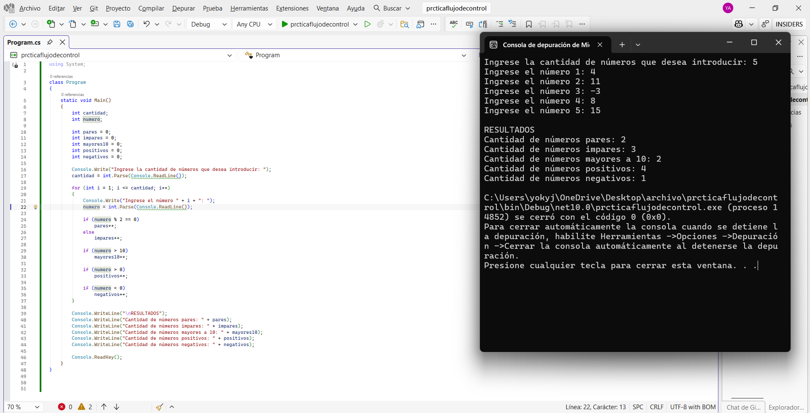
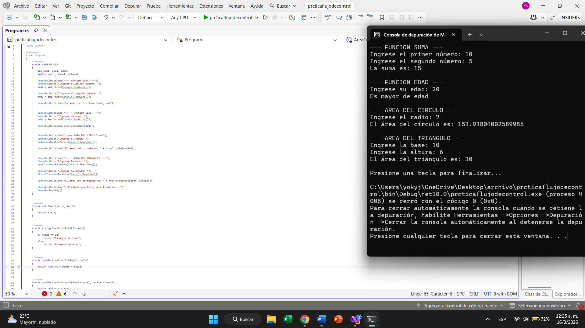

# Práctica No. 2 – Flujo de Control Parte 2

## Estudiante
Yocaira Mercedes

## Materia
Algoritmos Computacionales

## Lenguaje
C#

---

# Descripción

Este programa permite introducir una cantidad de números enteros y determina:

- Cantidad de números pares
- Cantidad de números impares
- Cantidad de números mayores a 10
- Cantidad de números positivos
- Cantidad de números negativos

También incluye funciones para:

- Sumar dos números
- Determinar si una persona es mayor o menor de edad
- Calcular el área de un círculo
- Calcular el área de un triángulo

---

# Evidencias del programa

## Ejecución del programa

---

# Herramientas utilizadas

- Microsoft Visual Studio
- Lenguaje C#
